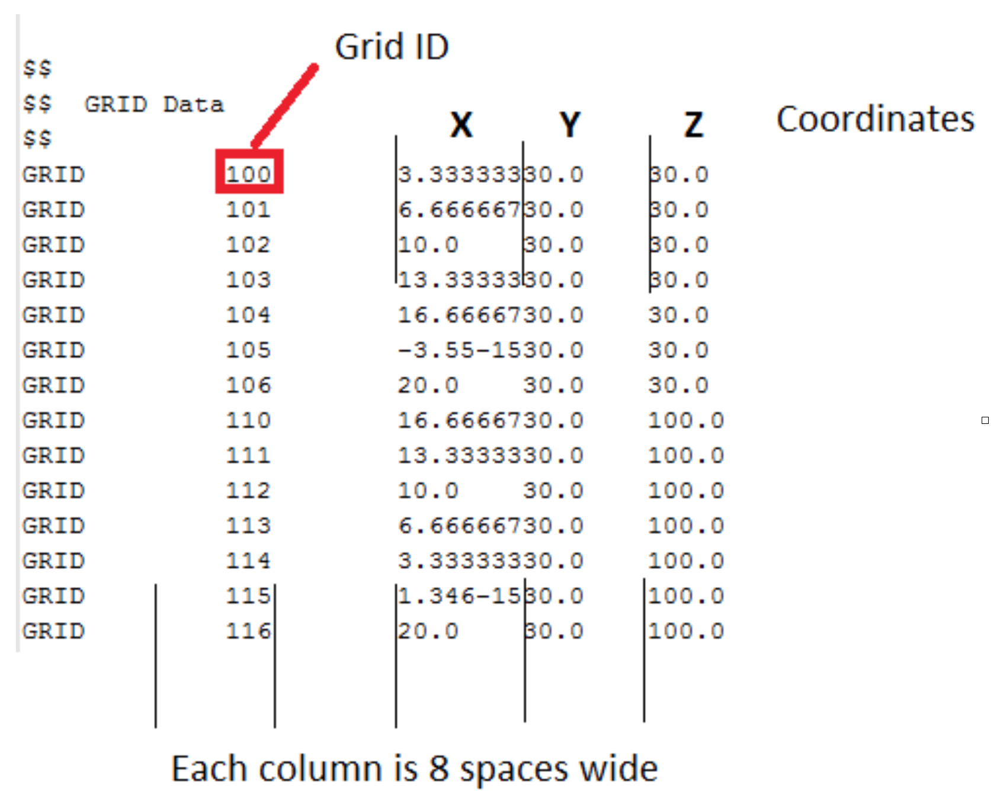
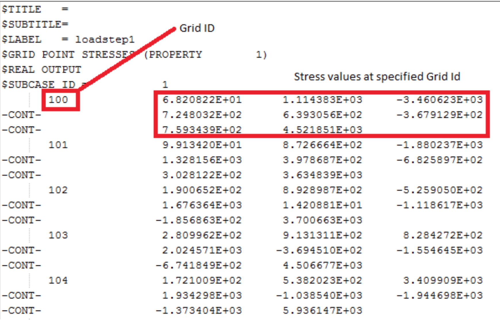

# nefarious-parakeet

So for now there are essentially 2 files that I want to read:
Good news is that I found out that both these files always has a fixed structure/format so there should be no anomaly cases ☺

The first is the input file to my simulation. It contains all the info about the structure I am simulating, including the coordinates of every node in the structure. 

I need an array which is 4 elements wide containing the each grid ID with its 3 coordinates. (it would be nice to store the Grid IDs at integers and the coordinates as floats, but it’s also ok to have them all as floats. It would also be great if this info could be stored in a python dictionary variable, but not essential.
I have included a sample file called “Input.pch” (can be opened by any text editor). You will see there is some stuff at the beginning that needs to be skipped. 
Take note: The grid ID values do not always follow consecutively on one another, but they should always appear in ascending order. I.e. in the pic above you will see they run 104,105,106 and then 110.
This should be a nice easy warm up exercise. If you want a slightly bigger challenge, but this is something I can do myself too, I need a function that can search through these points and finds all the points which lie in a straight line between two coordinate. The function also needs to sort them into the order that they appear along the line. I.e. the point closest to reference coordinate 1, then the point second closest…etc. In the file that I have given you, you will see that every increment of 6 grid points (up to grid ID 216) lie on a line, this will however not always be the case. *This is purely optional however!*

The second file is the results file from the simulation. I included an example called “Output.pch”
In this file we need to look for the line starting with “$GRID POINT STRESSES”. After that we need to confirm the “SUBCASE ID” number. In the pic shown below, this number is “1”. The files I will eventually be working with will probably have up to 7 subcases in each file and I will have to process the results for all seven of them.
In the file, after each grid ID, 8 stress values are given. I need the grid ID and the first 6 of the 8 stresses, for a specified list of grid IDs. This list will come from the optional part on the previous page. 

In both cases I would like to write the info that was gathered to a .csv file with the name:
“input_”+filename.csv  OR “results_”+filename.csv where filename is the name of the file from which the data is being read.
Finally I am going to need to do this whole process of reading this data and saving it many hundreds of time over…
